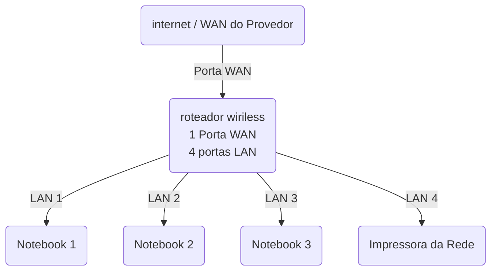

--
# Laboratorio de Redes 01 - Projeto de rede local
### Projeto desenvolvido na diciplina de Redes de computadores do Curso Técnico de Informática do SENAC Tatuapé.

Aluno: *Letícia G Libert* 
Professor: *José de Assis*  
Data: 09/03/2026

## 1. Objetivo

  Implementar uma rede local simples conectando 3 notebooks a um roteador wireless com switch integrado e uma impressora de rede.

  O projeto será realizado em duas etapas:

  1. Simulação da rede no Cisco Packet Tracer
  2. Implementação da rede no Cisco Packet Tracer

## 2. Equipamentos utilizados neste laboratório

- 3 notebooks
- 1 roteador wireless com 1 porta WAN e 4 portas LAN
- 1 impressora de rede
- 4 cabos de rede

## 3. Topologia da Rede 
Diagrama Lógico da rede utilizada neste laboratório

